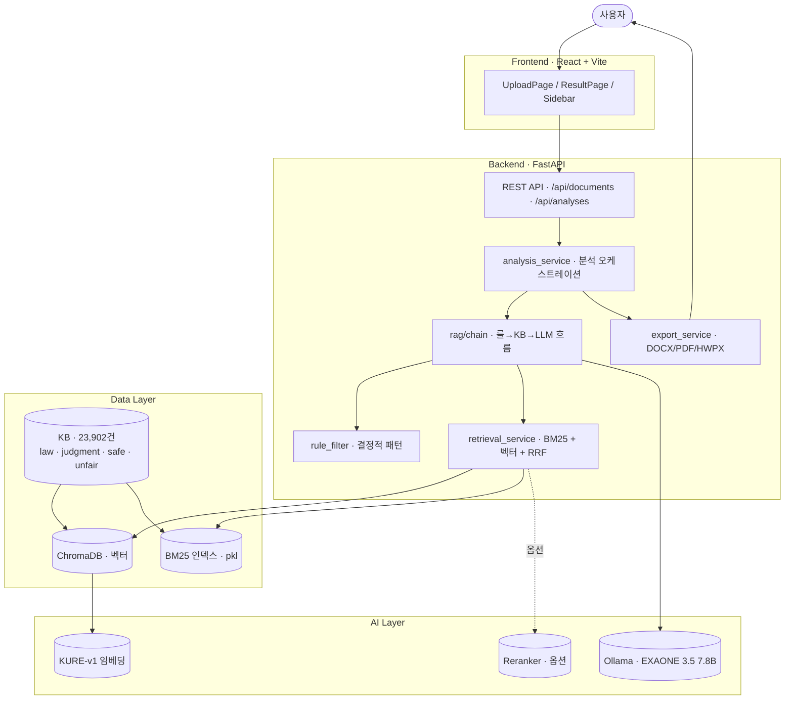
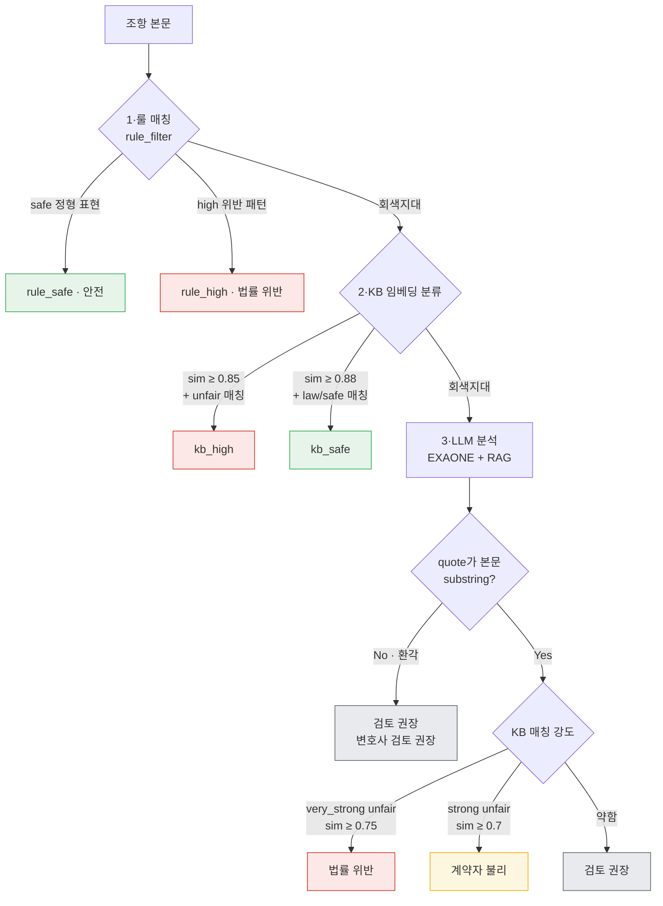
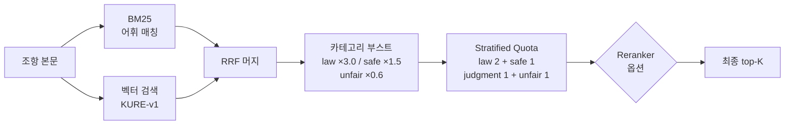

# 🛡️ ARGOS

> **로컬 LLM과 RAG 기술로 한국어 계약서의 모든 독소조항을 놓치지 않는 보안 특화 AI 검토 시스템**

그리스 신화의 백 개의 눈을 가진 감시자 *Argos*에서 이름을 가져왔습니다 — **모든 조항을 빠뜨리지 않고 검토한다**는 의미.

외부 API 호출 없이 로컬 환경에서만 동작합니다. PDF · DOCX · HWP · HWPX 계약서를 업로드하면 조항별로 위험도를 4단계로 분류하고, 관련 법률·판례·표준약관 근거와 함께 수정안을 제시합니다.


---

## ✨ 차별점

| 영역 | 일반 RAG 시스템 | ARGOS |
|---|---|---|
| **검색** | 단일 벡터 검색 | BM25 + 벡터 + RRF + 카테고리 stratified quota |
| **분류** | LLM 단독 판정 | 룰 → KB → LLM 3-stage + evidence-based hallucination filter |
| **신뢰도** | 점수만 표시 | quote의 본문 substring 검증 → 환각이면 검토 권장으로 강등 |
| **등급** | high/low 2분류 | **법률 위반 / 계약자 불리 / 검토 권장 / 안전** (액션 중심 4단계) |
| **근거** | 인용 X | retrieval 출처(law/judgment/clause) 분리 표시 + 매칭 강도 |
| **데이터 보안** | 외부 API 호출 | **완전 로컬** — 외부 송출 0 |

검증 정확도: **lease 도메인 538건 기준 96.8%** (false positive 거의 0).

---

## 🏗️ 시스템 아키텍처

### 전체 구성



### 분석 파이프라인 (조항당)



### 하이브리드 검색 흐름



- **vec_sim · bm25_sim · match_source 분리 저장** — 단일 source 매칭(BM25-only)은 어휘 우연 겹침일 가능성이 높아 표시 점수에 0.6× 패널티
- **카테고리 부스트** — KB 분포(판례 83% / 법률 12% / 약관 5%)의 극단적 불균형 보정. 법률 본문이 항상 top-K에 노출되도록 stratified quota와 이중 안전장치 적용

---

## 🎯 주요 기능

- **5개 계약 유형 자동 감지** — 임대차 / 매매 / 근로 / 용역·도급 / 금전소비대차
- **조항 자동 분리** — `제N조` 패턴 + 단락 폴백
- **4단계 위험 분류** — 액션 중심 라벨 (법률 위반 → 즉시 수정 / 계약자 불리 → 협상 / 검토 권장 / 안전)
- **Evidence-based hallucination filter** — quote 본문 substring 검증으로 환각 차단
- **표준약관 기반 수정안 자동 생성** — high/medium 조항에 대해 LLM이 권고안 작성
- **사용자 직접 수정안 저장** — 권고안 편집 + 영구 저장
- **수정안 반영 계약서 내보내기** — DOCX / PDF / HWPX
- **분석 결과 시각화** — 위험도 도넛 차트 · 조항 히트맵 · KB 매칭 사례 비교 패널 · 카테고리별 근거 그룹

---

## 📊 지원 계약 유형

| 유형 | 분석 관점 | 주요 위험 유형 |
|---|---|---|
| 임대차 (lease) | 임차인 | 보증금 미반환 · 일방적 해지 · 수선의무 전가 · 묵시적 갱신 배제 |
| 매매 (sales) | 매수인 | 하자담보 면제 · 소유권이전 지연 · 계약금 과다 · 권리하자 미고지 |
| 근로 (employment) | 근로자 | 부당해고 · 임금 부당 · 경업금지 과다 · 연차 미보장 · 퇴직금 미지급 |
| 용역·도급 (service) | 수급인 | 대금 지급 지연 · 일방적 해제 · 지식재산권 전가 · 과도한 하자담보 |
| 금전소비대차 (loan) | 차주 | 이자제한법 초과 · 과도한 지연손해금 · 기한이익 상실 남용 |

## 📁 지원 파일 형식

| 형식 | 확장자 | 입력 처리 | 출력 처리 |
|---|---|---|---|
| PDF | `.pdf` | PyMuPDF | reportlab |
| Word | `.docx` | python-docx | python-docx |
| 한글 | `.hwp` / `.hwpx` | hwp2yaml (순수 Python) | OWPML ZIP 직접 생성 |

---

## 🛠️ 기술 스택

### Backend
- **FastAPI** + Uvicorn — REST API
- **Ollama** + langchain-ollama — 로컬 LLM 서빙
- **EXAONE 3.5 7.8B** — 한국어 특화 LLM (4-bit 양자화)
- **KURE-v1** (`nlpai-lab/KURE-v1`) — 한국어 retrieval SOTA 임베딩
- **ChromaDB** — 벡터 저장소 (로컬 persist)
- **rank-bm25** — 어휘 기반 sparse retrieval
- **(옵션) Cross-encoder reranker** — `BAAI/bge-reranker-v2-m3` 등

### Frontend
- **React 18** + **Vite**
- **React Router** — 라우팅
- **Axios** — API 통신 (5분 타임아웃)
- 외부 차트 라이브러리 0 — SVG 직접 그림 (폐쇄망 대응)

### 지식베이스 (KB)
- **23,902건** — 5개 도메인 × 4 카테고리
- 카테고리: `law` (법률 본문) · `judgment` (판례) · `safe_clause` (표준약관) · `unfair_clause` (불공정약관 사례)
- 출처: legalize-kr GitHub (법률 9개 509조문) + AI Hub 약관·판결문 + 내장 정형 표현

---

## 🚀 설치 및 실행

### 사전 요구사항

| 프로그램 | 버전 | 다운로드 |
|---|---|---|
| Python | 3.11+ | https://www.python.org/downloads/ |
| Node.js | 18+ (LTS) | https://nodejs.org/ |
| Ollama | 최신 | https://ollama.ai |

### 1. AI 모델 다운로드 (~5GB)

```bash
ollama pull exaone3.5:7.8b
```

### 2. 환경 설정

**Windows:**
```bat
copy .env.example .env

python -m venv .venv
.venv\Scripts\activate
pip install -r backend\requirements.txt

cd frontend && npm install && cd ..
```

**macOS / Linux:**
```bash
cp .env.example .env

python -m venv .venv && source .venv/bin/activate
pip install -r backend/requirements.txt

cd frontend && npm install && cd ..
```

### 3. 지식베이스 구축 (최초 1회)

```bash
# 권장: 법률 본문 다운로드 → 전체 KB 인덱싱
python -m backend.scripts.download_laws
python -m backend.scripts.build_kb --include-laws --clear

# 빠른 시작: 내장 데이터만
python -m backend.scripts.build_kb

# AI Hub 약관·판결문 포함 (backend/data/raw/aihub/ 에 데이터가 있을 때)
python -m backend.scripts.build_kb --data-dir backend/data/raw/aihub
```

> ⚠️ 재빌드 시 `--clear` 또는 `data/chroma/` 디렉토리 수동 삭제 필요. AI Hub 항목은 매 실행마다 새 ID로 삽입되어 중복이 누적됩니다.

### 4. 서비스 시작

**Windows:** `start.bat` 더블클릭 또는 터미널 실행
**macOS / Linux:** `./start.sh`

브라우저에서 http://localhost:5173 접속.

### 종료

`stop.bat` (Windows) 또는 `./stop.sh` (Mac/Linux)

---

## 📡 접속 주소

| 서비스 | URL |
|---|---|
| 웹 화면 | http://localhost:5173 |
| Backend API | http://localhost:8000 |
| API 문서 (Swagger) | http://localhost:8000/docs |

---

## 📂 프로젝트 구조

```
Contract-Guard/
├── backend/
│   ├── app/
│   │   ├── api/                  # FastAPI 라우터
│   │   │   ├── documents.py      # POST /api/documents/upload
│   │   │   ├── analyses.py       # GET/PATCH/DELETE /api/analyses/...
│   │   │   ├── kb.py             # KB 통계
│   │   │   └── health.py
│   │   ├── models/               # Pydantic 모델
│   │   ├── rag/
│   │   │   ├── chain.py          # 분류 흐름 오케스트레이션 (룰→KB→LLM)
│   │   │   └── prompts.py        # LLM 프롬프트 빌드
│   │   ├── services/
│   │   │   ├── analysis_service.py    # 분석 진입점 + reclassify + evidence filter
│   │   │   ├── retrieval_service.py   # 하이브리드 검색 (BM25+벡터+RRF+stratified)
│   │   │   ├── rule_filter.py         # 결정적 룰 (safe/high 패턴)
│   │   │   ├── chroma_service.py      # ChromaDB 어댑터
│   │   │   ├── bm25_service.py        # BM25 인덱스 + 한국어 토크나이저
│   │   │   ├── embedding_service.py   # KURE-v1 임베딩 싱글턴
│   │   │   ├── llm_service.py         # Ollama LLM 싱글턴
│   │   │   ├── reranker_service.py    # Cross-encoder reranker (옵션)
│   │   │   ├── rewrite_service.py     # 권고 수정안 생성
│   │   │   ├── summary_service.py     # 종합 요약 생성
│   │   │   ├── document_service.py    # PDF/DOCX/HWP 텍스트 추출
│   │   │   ├── clause_service.py      # 계약 유형 감지 + 조항 분리
│   │   │   └── export_service.py      # DOCX/PDF/HWPX 출력
│   │   ├── contract_types.py     # 5도메인 프롬프트 + 위험 유형 + 내장 KB
│   │   ├── config.py             # 환경변수 기반 설정
│   │   └── main.py               # FastAPI 앱 진입점
│   └── scripts/
│       ├── download_laws.py      # legalize-kr에서 법률 본문 다운로드
│       ├── build_kb.py           # KB 빌드 (ChromaDB + BM25)
│       ├── validate.py           # 분석 정확도 검증
│       └── test_real_pdf.py      # 단일 PDF 직접 분석 (디버깅)
├── frontend/
│   └── src/
│       ├── pages/                # UploadPage, ResultPage
│       ├── components/           # FileUploader, RiskBadge, RiskPieChart, Sidebar
│       ├── context/              # AnalysesContext (사이드바 이력)
│       ├── api/                  # Axios 클라이언트
│       └── styles/               # 글로벌 CSS (검정+골드 미니멀 + Apple typography)
├── data/
│   ├── chroma/                   # ChromaDB 벡터 저장소
│   ├── bm25/                     # BM25 인덱스 (도메인별 .pkl)
│   ├── uploads/                  # 업로드 파일 원본
│   └── results/                  # 분석 결과 JSON (수정안 영속화)
└── README.md
```

---

## 🌐 API 레퍼런스

| Method | Endpoint | 설명 |
|---|---|---|
| `GET` | `/health` | Ollama 연결 상태 + KB 문서 수 |
| `POST` | `/api/documents/upload` | 파일 업로드 + 분석 (multipart/form-data) |
| `GET` | `/api/analyses` | 분석 이력 목록 (사이드바용) |
| `GET` | `/api/analyses/{id}` | 분석 결과 단건 조회 |
| `DELETE` | `/api/analyses/{id}` | 분석 결과 삭제 |
| `PATCH` | `/api/analyses/{id}/clauses/{clause_index}` | 사용자 수정안 저장/삭제 |
| `GET` | `/api/analyses/{id}/export?format=docx\|pdf\|hwpx` | 수정안 반영 계약서 다운로드 |
| `GET` | `/api/kb/status` | KB 카테고리별 집계 |

### 응답 예시 (요약)

```json
{
  "status": "completed",
  "result": {
    "id": "analysis-uuid",
    "filename": "contract.pdf",
    "total_clauses": 11,
    "risky_clauses": 6,
    "summary": "■ 종합 평가\n총 11개 조항 중 6개에서 ...",
    "clause_analyses": [
      {
        "clause_index": 4,
        "clause_title": "제4조 (보증금 반환)",
        "risk_level": "high",
        "confidence": 0.88,
        "analysis_status": "rule_high",
        "risks": [{
          "risk_type": "보증금_미반환_위험",
          "description": "보증금 반환을 3개월 이상 지연하는 조항 ...",
          "suggestion": "반환 시점과 공제 기준을 명확히 ...",
          "quote": "보증금을 명도한 후 3개월 이내에 반환한다"
        }],
        "references_detail": [{
          "text": "민법 제624조 (임대인의 의무) ...",
          "source": "민법",
          "category": "law",
          "similarity": 0.82,
          "match_source": "both"
        }],
        "explanation": "임차인에게 불리한 보증금 반환 제한 조항입니다. ...",
        "suggested_rewrite": "임대인은 계약 종료일로부터 1개월 이내에 ...",
        "user_override": null
      }
    ]
  }
}
```

---

## ⚙️ 환경 변수

`.env.example`을 복사하여 `.env`로 사용. 대부분 기본값 그대로 OK.

| 변수 | 기본값 | 설명 |
|---|---|---|
| `OLLAMA_MODEL_NAME` | `exaone3.5:7.8b` | LLM 모델 |
| `OLLAMA_BASE_URL` | `http://localhost:11434` | Ollama 서버 |
| `OLLAMA_TIMEOUT` | `60` | LLM 호출 타임아웃 (초) |
| `OLLAMA_NUM_PARALLEL` | `1` | Ollama 병렬 처리 (12GB VRAM 환경에서 1 권장) |
| `EMBEDDING_MODEL` | `nlpai-lab/KURE-v1` | 임베딩 모델 |
| `EMBEDDING_DEVICE` | `auto` | `auto` / `cpu` / `cuda` |
| `RERANKER_ENABLED` | `false` | Cross-encoder reranker 활성화 |
| `RETRIEVAL_TOP_K` | `8` | 조항당 retrieve 개수 |

> `temperature=0.3`, `num_ctx=8192`, `num_predict=4096`, `BATCH_SIZE=3`, `PER_CLAUSE_TIMEOUT=120` 은 코드 하드코딩.

---

## 🧪 개발자용 스크립트

```bash
# 법률 본문 다운로드 (legalize-kr GitHub, 최초 1회)
python -m backend.scripts.download_laws

# KB 재빌드 (법률 본문 + AI Hub 모두 포함)
python -m backend.scripts.build_kb --include-laws --clear --data-dir backend/data/raw/aihub

# 분석 정확도 검증 (lease 도메인 538건)
python -m backend.scripts.validate

# 단일 PDF 직접 분석 (디버깅 용)
python -m backend.scripts.test_real_pdf path/to/contract.pdf
```

---

## 🛡️ 데이터 프라이버시

- **계약서 데이터는 로컬에서만 처리** — 외부 API·LLM 호출 0
- 임베딩·LLM 모델 모두 로컬 디스크에 캐시 (HuggingFace · Ollama)
- 분석 결과 JSON은 `data/results/` 에 저장. 외부 송출 없음

---

**License**: MIT
